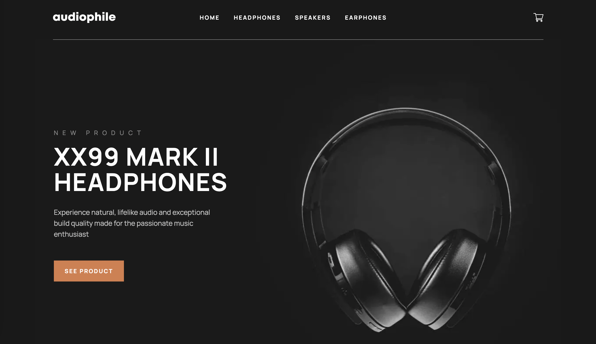

# Frontend Mentor - Audiphole Ecommerce Website Solution

This is a solution to the [Audiophile Ecommerce challenge on Frontend Mentor](https://www.frontendmentor.io/challenges/audiophile-ecommerce-website-C8cuSd_wx). 

## Table of contents

- [Overview](#overview)
  - [Screenshot](#screenshot)
- [My process](#my-process)
  - [Built with](#built-with)
  - [Features left](#features-left)
  - [What I learned](#what-i-learned)

# Overview
## Screenshot

# My Process
## Built with
- NextJS (React Framework for SSR)
- TailwindCSS (Utility-first CSS framework)
- Firestore Database (NOSQL firebase dataabse)
- Cloudinary (for image storage)

## What I learned
- NextJS and the power of server-side rendering (SSR). I learned about NextJS **Dynamic Routing** and used it to build product pages under certain cagetories. For example: `/pages/headphones/[slug].js`
- `getStaticPaths` inside the `[slug].js` files queries firebase database to find list of products and statically pre-renders the dynamic routes based on the products available. Because data is available during build time, I used `getStaticProps` to generate the dynamic pages based on `paths`. This function runs only on server side.
- I wanted to experiment with quering from multiple sources of data. Thats why all the images are stored in Cloudinary and product data comes from Firebase. I have used NextJS `next/image` **Image Optimizations** for faster page loading.
- It was very fun building the website with TailwindCSS with mobile-first approach. There are so many images and the structure of the page change drastically depending on device screen space. I have used resized images for tablet/mobile/desktop sizes, combined with `next/image` optimizations to make laoding time faster.
- NextJS provides so much more features and I would love to make more projects with this framework.

## Features left to implement
- Cart to add products
- Checkout page
